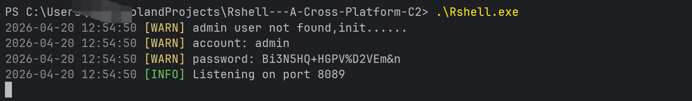
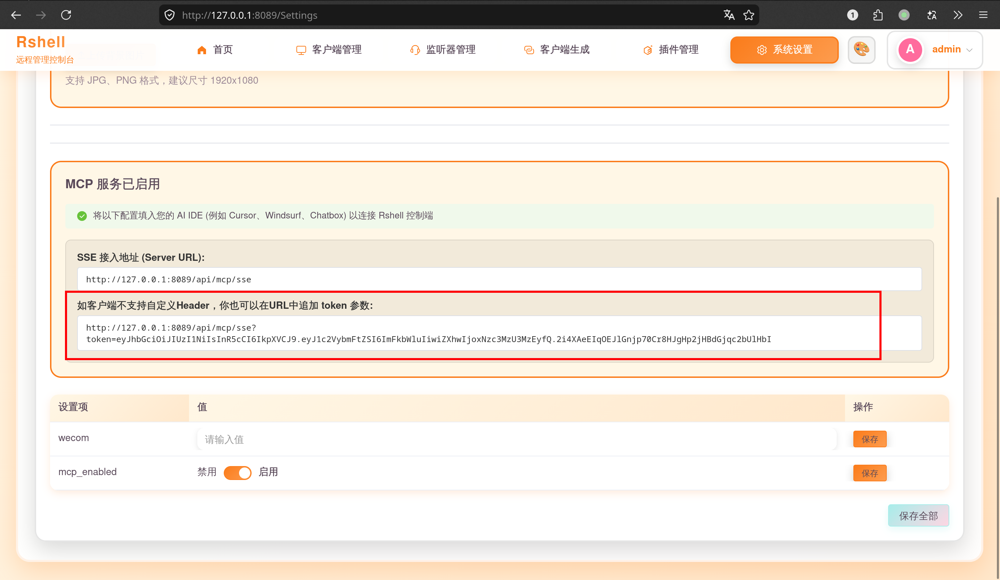
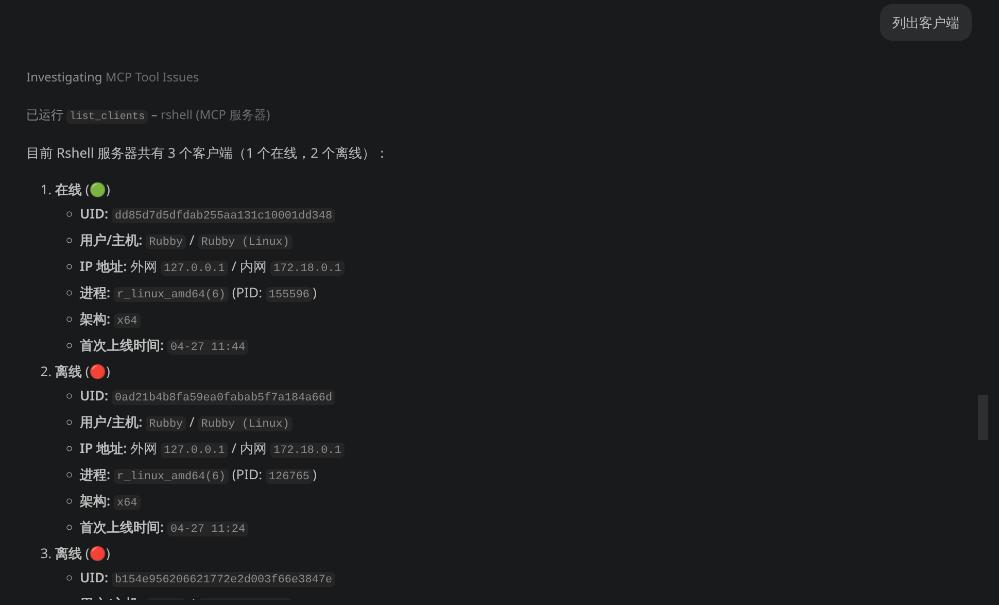
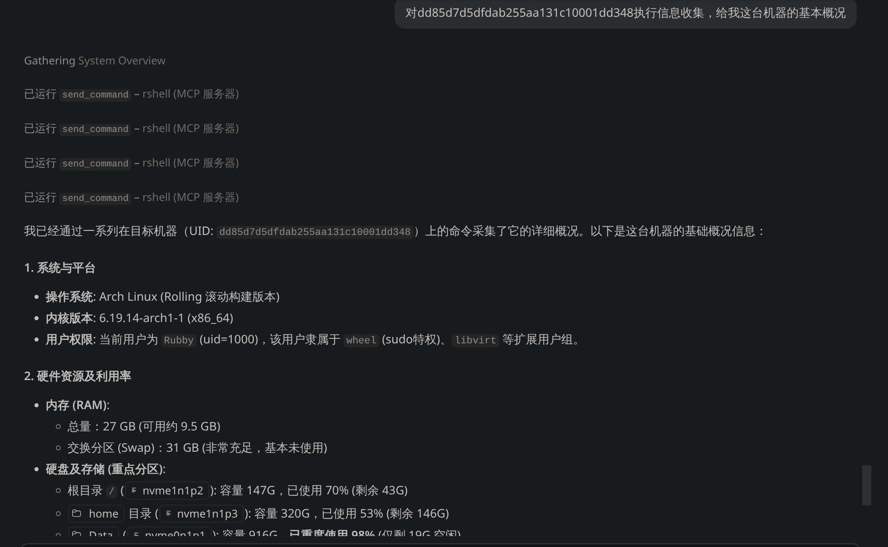
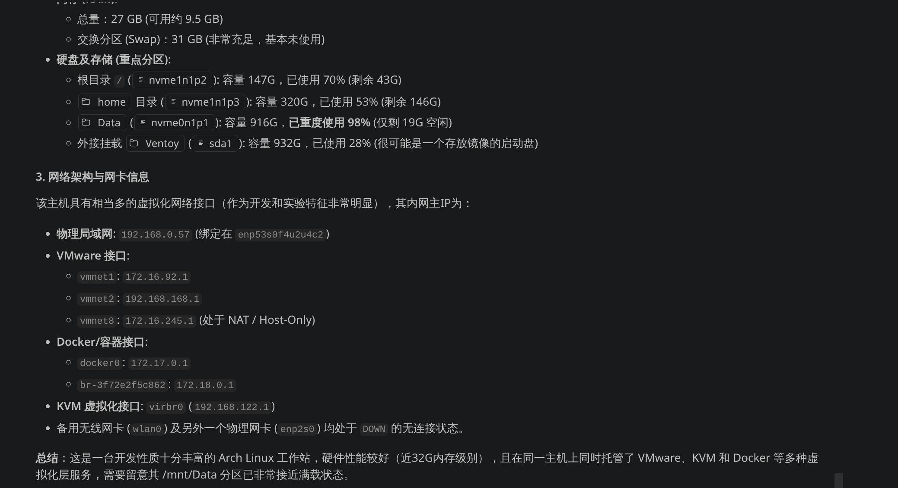

# Rshell 使用文档

## 账号密码

**账号:admin**

**密码:首次运行后随机生成**

## 主题修改

### 修改主题颜色

### 添加背景图片

## 添加listener

目前支持websocket、tcp、kcp、http、oss协议监听：

## 生成客户端

支持windows、linux、darwin

**注：客户端可选配置反沙箱密码上线  如： r.exe tNROopcR45q4Z8I1**

## Webdelivery

## 客户端管理

### 支持Note、颜色标记

### 命令执行

shell + [cmd]

### 交互式终端

建议在websocket、tcp、kcp的长连接协议下使用，http协议下可以将sleep时间设置为0，以获得低延迟体验。

### 文件管理

双击进入文件夹：

### PID查看

杀毒软件识别

### 文件下载

### 笔记

## Windows相关

### shellcode生成：

生成步骤：

（1）新建监听；
（2）建立对应监听的windows版的webdelivery；
（3）在对应的webdelivery的右侧，有shellcode生成的选项。

新增windows的webdelivery后，可以生成stage分阶段的shellcode（体积较小，方便上线）：

### 内存执行

windows内存执行 支持Execute Assembly(.net程序内存执行)、Inline Bin(其他exe程序内存执行)、shellcode执行(执行shellcode,方便上线其他C2等)、Inline Execute(执行BOF)：

#### execute-assembly

执行badpotato提权：

#### inline-bin

内存执行fscan：

#### shellcode-inject

上线msf：

#### inline-execute

执行bof：

## 插件管理

新增插件：

调用插件：

## MCP

目前 Rshell 的 MCP (Model Context Protocol) 接口支持非常丰富的功能，涵盖了从基础配置到远控操作个维度的能力。以下是具体支持的功能列表：

### 📡 1. 客户端管理 (Clients)

- **获取客户端列表 (`list_clients`)**：列出所有上线、离线的客户端/Bots 基础信息。
- **发送 Shell 命令 (`send_command`)**：向指定的客户端（基于 UID、IP 或备注）下发系统命令。
- **读取 Shell 历史的内容 (`get_shell_content`)**：获取特定客户端上已执行 Shell 命令的历史回显内容。
- **断开客户端 (`exit_client`)**：干净地退出或切断目标客户端连接。
- **读写客户端备注 (`get_client_note` / `edit_client_note`)**：查看或修改某个客户端的备注信息。

### ⚙️ 2. 进程控制 (Processes)

- **获取进程列表 (`get_target_processes`)**：列出目标客户端上当前活跃的系统进程 (ps)。
- **强杀进程 (`kill_pid`)**：根据 PID 终止目标客户端上的特定进程。

### 📁 3. 文件系统操作 (File System)

- **浏览文件系统 (`target_file_browse`)**：浏览目标客户端的文件和目录结构。
- **读取文件内容 (`fetch_file_content`)**：读取目标磁盘上具体文件的文本内容。
- **创建目录 (`make_dir`)**：在目标系统上新建文件夹。
- **删除文件 (`file_delete`)**：删除目标系统上的特定文件。

### 🎧 4. 监听器管理 (Listeners)

- **列出监听器 (`list_listeners`)**：显示服务端当前配置的所有网络监听端口。
- **新增监听器 (`add_listener`)**：在 C2 上添加基于 WebSocket、TCP、KCP、HTTP 或 OSS 的监听器。
- **启停监听器 (`open_listener` / `close_listener`)**：开启被停止的监听器或临时关闭现有的监听器。
- **删除监听器 (`delete_listener`)**：移除不再需要的监听器配置。

### 🧩 5. 插件与代理 (Plugins & Proxies)

- **查询可用插件 (`list_plugins`)**：列出服务端自带或安装的所有功能插件。
- **执行插件 (`execute_plugin`)**：在目标客户端上执行指定的插件任务。
- **查看 Socks5 代理 (`list_socks5`)**：列出所有由 Bot 发起且处于活动状态的 Socks5 代理信息。
- **查看 Web 投递 (`list_web_delivery`)**：列出 WebDelivery (载荷分发) 相关的有效端点与状态。

### 🛠️ 6. 全局设置与高级调试 (Settings & Advanced)

- **获取全局设置 (`list_settings`)**：列出 C2 数据库中的全局配置或环境信息（如 Token 等）。
- **修改全局设置 (`edit_settings`)**：编辑指定的参数值。
- **内部接口调试 (`advanced_http_post`)**：支持发送原生 JSON 数据包给未注册的内部 POST 路由。

这些支持均可以通过 AI 代理进行自动化调用底层工具直接操作，极大释放了无控制台下的远程网络管理能力。

### 开启MCP功能：

### 列出客户端：

### 信息收集：

